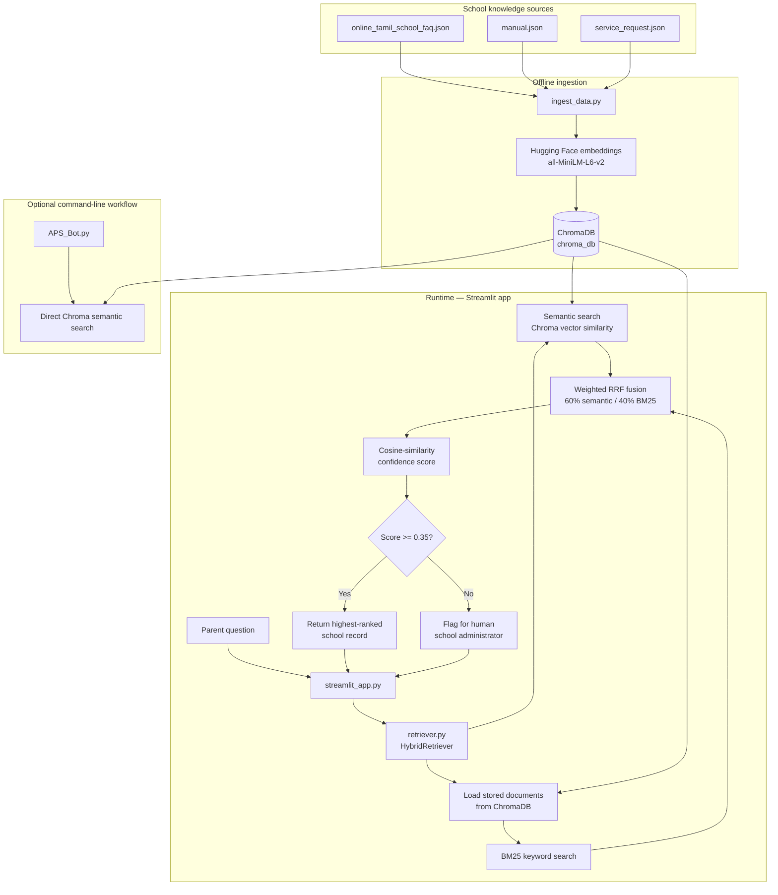

# APS Online Tamil School — Retrieval Architecture

## Retrieval mechanisms

1. **Semantic search** uses ChromaDB and local Hugging Face embeddings to find records with similar meaning.
2. **BM25 search** uses keyword matching across documents loaded from ChromaDB.
3. **Reciprocal Rank Fusion (RRF)** combines the semantic and BM25 result rankings.
4. **Cosine similarity scoring** determines whether the app answers from the best record or flags the question for a human administrator.
